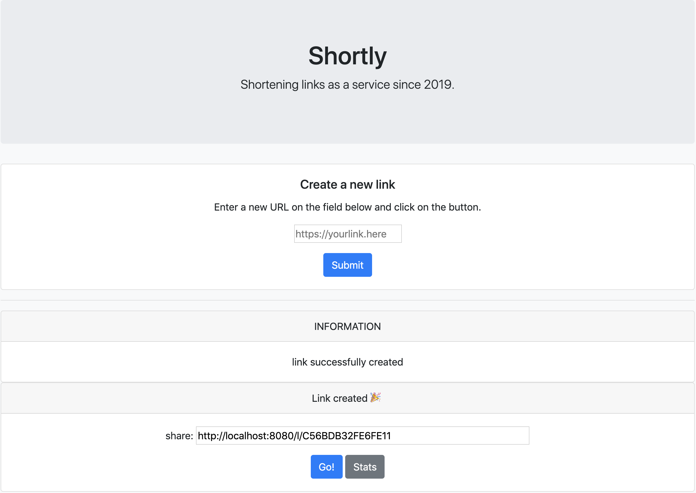

# [Shortly](https://github.com/rijil-tr/shortly)

[](https://goreportcard.com/badge/github.com/rijil-tr/shortly)
[](https://img.shields.io/github/issues/rijil-tr/shortly)
[](https://img.shields.io/github/forks/rijil-tr/shortly)
[](https://img.shields.io/github/stars/rijil-tr/shortly)


[](https://faun.dev/join?utm_source=faun&utm_medium=github&utm_campaign=kubernetes-workshop)

Shortly is a simple URL shortener service written in Golang.
More detailed step by step tutorial can be found [here](https://github.com/campoy/links).

### Running Shortly

```sh
go run cmd/main.go
```

### Testing using cURL

Generate a short URL
`curl 'http://localhost:8080/' -H 'Content-Type: application/x-www-form-urlencoded' --data 'link=https://google.com'`

Redirect
`curl http://localhost:8080/l/3E84B09B18848F91`

Visitor Count
`curl http://localhost:8080/s/3E84B09B18848F91`

---
#### Task Lists
- [x] Write a simple URL shortening REST service
- [x] Add instrumentation and logging
- [ ] Add authentication layer
- [ ] Add support for GRPC
- [ ] Create a key generator micro service
- [ ] Build UI in ReactJS
- [ ] Deploy services using Kubernetes 
---