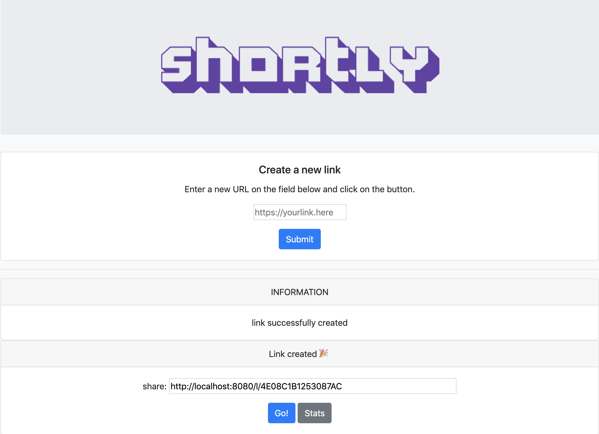

# [Shortly](https://github.com/rijil-tr/shortly)

[](https://goreportcard.com/badge/github.com/rijil-tr/shortly)
[](https://img.shields.io/github/issues/rijil-tr/shortly)
[](https://img.shields.io/github/forks/rijil-tr/shortly)
[](https://img.shields.io/github/stars/rijil-tr/shortly)


[](https://faun.dev/join?utm_source=faun&utm_medium=github&utm_campaign=kubernetes-workshop)

Shortly is a simple URL shortener service written in Golang.
More detailed step by step tutorial can be found [here](https://github.com/campoy/links).


Our URL shortening system should meet the following requirements:

---
### Functional
- [X] Given a URL, our service should generate a shorter and unique alias of it. This is called a short link.
- [X] When users access a short link, our service should redirect them to the original link.
- [ ] Users should optionally be able to pick a custom short link for their URL.
- [ ] Links will expire after a standard default timespan. Users should be able to specify the expiration time.

### Non-Functional
- [ ] The system should be highly available.
- [X] URL redirection should happen in real-time with minimal latency.
- [X] Shortened links should not be guessable.
---
### Running Shortly

```sh
go run cmd/main.go
```

### Testing using cURL

Generate a short URL
`curl 'http://localhost:8080/' -H 'Content-Type: application/x-www-form-urlencoded' --data 'link=https://google.com'`

Redirect
`curl http://localhost:8080/l/3E84B09B18848F91`

Visitor Count
`curl http://localhost:8080/s/3E84B09B18848F91`